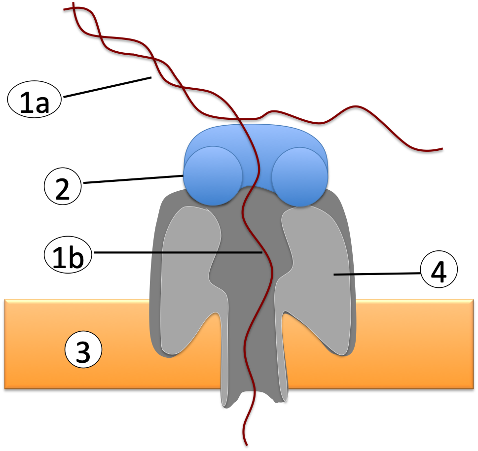

```{r setup, include=FALSE}
knitr::opts_chunk$set(echo = TRUE)
```

####1. Explain basic principles of Nanopore sequencing. 

**Find peer-reviewed information about the Nanopore sequencing technique as employed by Oxford Nanopore Technologies (ideally including at least one describing the MinION technology in detail). Cite the references you found useful to address the following questions (0.5 pts for the citations alone)**

Jain, Miten, et al. "The Oxford Nanopore MinION: delivery of nanopore sequencing to the genomics community." Genome biology 17.1 (2016): 239.

Jain, Miten, et al. "Nanopore sequencing and assembly of a human genome with ultra-long reads." Nature biotechnology 36.4 (2018): 338.

Karamitros, Timokratis, and Gkikas Magiorkinis. "A novel method for the multiplexed target enrichment of MinION next generation sequencing libraries using PCR-generated baits." Nucleic acids research 43.22 (2015): e152-e152.

https://nanoporetech.com/how-it-works/types-of-nanopores

https://nanoporetech.com/products/promethion

https://nanoporetech.com/resource-centre/versatile-sequencing-library-preparation-methods-minion-gridion-and-promethion

#####In one sentence, summarize the principle of Nanopore sequencing.

The principle of Nanopore sequencing is to determine DNA and RNA sequences by passing an ionic current through nanopores, fixed in a membrane, and measuring the current changes to determine sequence as the biological molecules pass through the nanopore. 

#####Label the following image.

{width=50%}

1a - dsDNA

1b - ssDNA

2 - unwinding enyzyme

3 - synthetic polymer membrane

4 - nanopore protein

#####Describe 2 properties that the molecule labeled with (4) must have.

This protein must create a pore in the membrane, as well as hold an adapter molecule which is used to keep bases held in place long enough for the current change reflecting the present bases to be accurately measured. 

#####Where is the change of current registered?

The change of current is registered by an electrode in a microwell that is just outside the nanopore. 

#####Which naturally occuring types of proteins could be used for the molecule labeled with (2) and why, i.e. what are the properties that are needed?

DNA helicases are especially fit for this protein, as: 

  - They can separate dsDNA into single strands

  - They bind single-stranded DNA independently of sequence
  
  - Use ATP to feed the ssDNA through pores
  
#####There are three types of adapters that are ligated to the DNA prior to sequencing. Explain their functions

Biotin adapters - ligate to PCR baits to allow for targetted enrichment, as the adapters will all the targeted sequences to be captured by streptavidin beads and isolated prior to PCR. Only used in PCR-based library prep. 

PCR adapters - ligate to sheared DNA and allow for subsequent amplification via PCR. Only used in PCR-based library prep. 

Transposase adapters - transposase cleaves template sequence and attaches barcoded tags to cleaved ends. 

MioION sequencing adapters - These adpaters carry the motor proteins to the nanopore and allow for subsequent undwinding of DNA (if double-stranded)

####2. Describe 2 advantages and 2 disadvantages of Nanopore sequencing compared to Illumina-based sequencing.

Advantages: 

- Reads from 10kbs to 100kb's 

- No Amplification bias

- Easily transported

- Low machine cost

- Epigenetic such as methylation modifcations preserved (and in future detected)

- Can choose/manipulate read lengths

Disadvantgaes: 

- Loud

- Continuous changing of enzymes and proteins in next generation nanopore sequencers doesn't allow for complete incorporation of older nanopore sequencing readouts into machine learning/AI alorithms. 

- 92-97% accuracy for single reads. However, opposed to Illumina, regions of DNA will often produce errors around similar sequences, making certain regions of genome difficult to obtain accurate consensus on. 

####3. Basic QC

#####Run FastQC on the Nanopore fastq files in this folder: /home/frd2007/ANGSD_2019/nanopore_seq/guppy_out/.

To carry this out, and then download output onto my personal computer, I ran the following code (first line on farina, the second in a directory on my computer): 

```{}
fastqc /home/frd2007/ANGSD_2019/nanopore_seq/guppy_out/*.gz --extract -o .

scp -r ptg4001@aristotle.med.cornell.edu:hw_11_fastqc .
```

#####Describe 2 observations that seem very different when compared to FastQC results of Illumina-based runs.

- Sequence length: The sequence lengths of the MinION FastQC results range between the 100s to upwards of 50k, while the average sequence lengths of Illumina-based runs are only be 50-100 bases. 

- Per base sequence qualities: Illumina-based runs show much higher average per base sequence quality scores (around 36) as compared to the MinION run FastQC scores (around 22 on average)